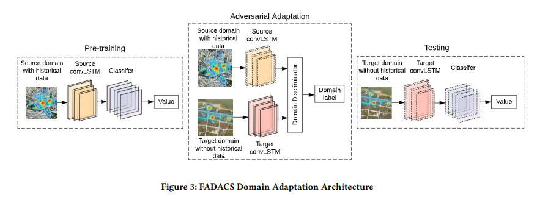
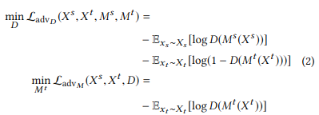
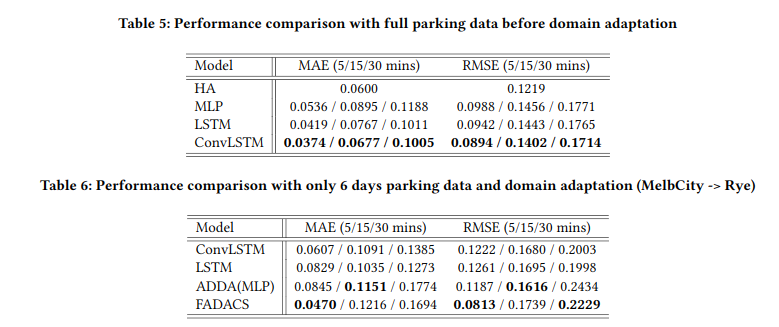

# FADACS: A Few-shot Adversarial Domain Adaptation Architecture for Context-Aware Parking Availability Sensing


## Introduction
Parking availability sensing plays a vital role in urban planning and city management [24,37]. According to a recent study, drivers spend more than 100,000 hours per year in looking for parking their cars [27]. Moreover, seeking for available parking can lead to severe traffic congestion and air pollution [9]. Hence, effective parking availability sensing can help drivers find a vacant parking spot. This also helps government to take appropriate measure by understanding the utilisation of parking facilities and provide more on-street parking lot in the areas with high parking demand

## FADACS ARCHITECTURE
<p align="center"></p>

Next step is an adversarial adaptation, which is to learn a target encoder Mt(Xt)so that the discriminator D cannot distinguish the origin of that sample. By fixing source encoder parameter, the adversarial loss is used to minimise the distance of the mapping between source and target domain:Ms(Xs)and Mt(Xt) and maximise the discriminator loss.

<p align="center"></p>

In the final stage, we assemble the learned target encoder Mt(Xt) and regression model F together, and use data from the target domain to test its performance. The regressor should the ability to generate quality prediction since the latent features from the target domain is overlapping with the ones from the source domain after the previous adaptation stage.


## Results

In the first experiment, we compare a couple of existing approaches to predict the parking occupancy. We select four classic approach here: HA, MLP, LSTM and ConvLSTM. HA is a basic statistical method to estimate the parking occupancy based on the historical data by averaging them. The strength of this method is that HA can catch the periodical pattern of parking occupancy. However, it does not consider spatial dependency, temporal dependency and hidden trends in the data. Compared to HA, MLP can automatically explore the trends of the parking occupancy even though it also does not consider the spatio-temporal dependency. LSTM can predict the parking occupancy by leveraging the temporal dependency of the historical data which is the essential to time-series data prediction. However, as we mentioned in the introduction, the parking sensing not only relies on the temporal dependency but also relevant to the spatial dependency. ConvLSTM can integrate spatial and temporal features into one simple end-to-end model and Table 5also validates our assumption. In Table 5, ConvLSTM outperforms other classic parking prediction approach for all prediction horizons. LSTM outperforms the second since it consider the temporal dependency but not spatial dependency. MLP performs better than HA but lose the match to LSTM and ConvLSTM. This result suggests us that both spatial and temporal dependency play a role in the parking occupancy prediction, and the temporal dependency seems more important since the gap between the LSTM and MLP is much smaller than MLP and other approaches.
<p align="center"></p>


The first experiment shows that ConvLSTM perform the best in parking sensing. Then, we conduct a few-shot transfer learning test to validate the effectiveness of our proposed transfer learning model with a few training samples from the target domain. most machine learning techniques require thousands of examples to achieve good performance in parking prediction. The goal of few-shot learning is to achieve acceptable accuracy in parking sensing with a few training examples in target domain. We compare our model to four classic approaches used in spatio-temporal transfer learning area: LSTM with parameter transfer, ConvLSTM with parameter transfer, ADDA with MLP and our propose architecture. The first and second model are based on parameter transfer framework, which transfer the parameters trained in the source domain to the target domain. ADDA with MLP and our proposed architecture are GAN-based transfer learning framework. Table 6 shows that our approach perform the best. The ConvLSTM with parameter transfer perform better than LSTM with parameter transfer, and the ADDA with MLP perform the worst. This result validates our claim that both spatial and temporal dependency are significantly important in parking occupancy prediction, and adversarial learning is a good at learning the shared feature spaces. Additionally, it again validates that the importance of each component should be temporal dependency, spatial dependency and domain adaption. In summary, we have conducted two experiments with Melbourne CBD parking data, Rye parking data and multiple contextual features. The experimental results show that our approach which integrates spatial information, temporal information and domain adaption outperform other baselines. It also shows the importance of each component in predict parking occupancy in target domain by leveraging source domain historical data and contextual information.

## Prerequisites
Our code is based on Python3 (>= 3.8). Here is the dependencies to run the code. The major libraries are listed as follows, more detail please check the requirement.txt
* TensorFlow (>= 2.1.0)
* Torch (>=1.60)
* NumPy (>= 1.17.3)
* SciPy (>= 1.4.1)
* Pandas (>= 1.0.1)

## Dataset
The two cities that are being investigated in this research are the City of Melbourne and the town of Rye. Both are in the state of Victoria, Australia. Melbourne is the capital city of Victoria. The municipality of Melbourne, with an estimated of 178,955 residents[12], has nearly 1 million people on average per day, visiting the municipality for work, education, and travel or tourism. On the other hand, Rye is a little coastal town, part of the Mornington Peninsula Shire municipality. Rye has a population of approximately8,416 in the 2016 census and is located about 100km from the City of Melbourne. The Mornington Peninsula Shire hosts about 7.5 million visitors per year [26], and about 50% of those would visit Rye as one of their destinations, requiring parking spot, as driving is the main mode of transport to get into these coastal areas. Therefore, the major datasets in this paper include parking sensor data, Points of Interests (POI) data, weather data, and geographical data. All the datasets used in this system come from the following platforms: the City of Melbourne Open Data [13], Time and DateAS [29], Google Map API, and a proprietary Mornington Peninsula Shire data platform

### Pre-processed Data
[Download From Google Drive](https://drive.google.com/drive/folders/1ARLiwHIezdkHiT7tTzOS84vvbVJkLvn1?usp=sharing)


## Experiment Details

### Run FADACS Experiment
1. Unzip the dataset.7z file in experiments dir first
    ```
        ├── experiments
        │   └── FADACS
        │       ├── exp.json
        │       ├── MelbCity
        │       │   ├── testIndex.npy
        │       │   ├── trainIndex.npy
        │       │   ├── x.npy
        │       │   └── y.npy
        │       └── Mornington
        │           ├── testIndex.npy
        │           ├── trainIndex.npy
        │           ├── x.npy
        │           └── y.npy
    ```
2. Than run it
    ```python
    python run_FADACS.py
    ```

Or conduct experiments as you wish

1. Download the Pre-processed Data and unzip it first.
2. modify run_experiment_example.py then run it.

    ```python
    python run_experiment_example.py
    ```

## Updates
**Jan. 22, 2021**:
* All dataset of Mornington(Rye) has been removed due to confidential issues.

## Citation
Please refer to our paper. Shao, W., Zhao, S., Zhang, Z., Wang, S., Rahaman, M. S., Song, A., & Salim, F. D. (2021, March). FADACS: A Few-Shot Adversarial Domain Adaptation Architecture for Context-Aware Parking Availability Sensing. In 2021 IEEE International Conference on Pervasive Computing and Communications (PerCom) (pp. 1-10). IEEE.

@inproceedings{shao2021fadacs,
  title={FADACS: A Few-Shot Adversarial Domain Adaptation Architecture for Context-Aware Parking Availability Sensing},
  author={Shao, Wei and Zhao, Sichen and Zhang, Zhen and Wang, Shiyu and Rahaman, Mohammad Saiedur and Song, Andy and Salim, Flora D},
  booktitle={2021 IEEE International Conference on Pervasive Computing and Communications (PerCom)},
  pages={1--10},
  year={2021},
  organization={IEEE}
}
